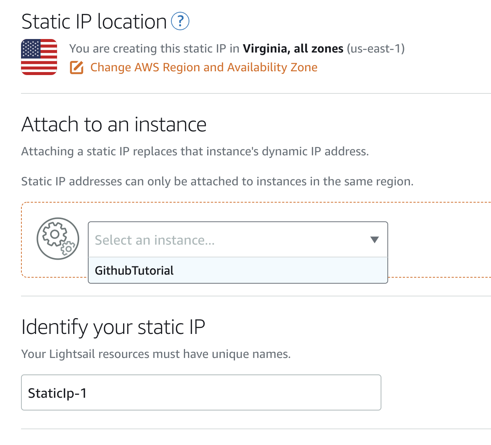
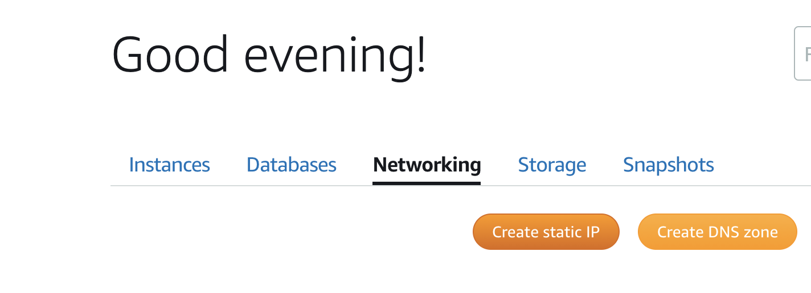

# Deploy a Node / Express app on AWS Lightsail with a Custom Domain + SSL

-------------> [Video Tutorial (_10 min_)](https://www.youtube.com/watch?v=rtshCulV2hk) <-------------

### Steps below if you prefer images

- Create a Lightsail instance from the **[AWS dashboard](https://lightsail.aws.amazon.com/ls/webapp/home/instances)**

- Choose your instance type

**_Linux & Node_**

- Wait for the instance to be created
  

- In the meantime, go to the **_Networking_** tab and create a static IP
  

- Attach the static IP you just created to your instance

- Go back [home](https://lightsail.aws.amazon.com/ls/webapp/home/instances) and click on [networking](https://lightsail.aws.amazon.com/ls/webapp/home/networking) so that you arrive at this tab

- Click on **_Create DNS zone_** and enter your domain here

> I personally use [Google Domains](https://domains.google.com/registrar/) to buy my domains but if you prefer to stay in the ecosystem, Amazon has their own solution called [Route53](https://aws.amazon.com/route53/)
