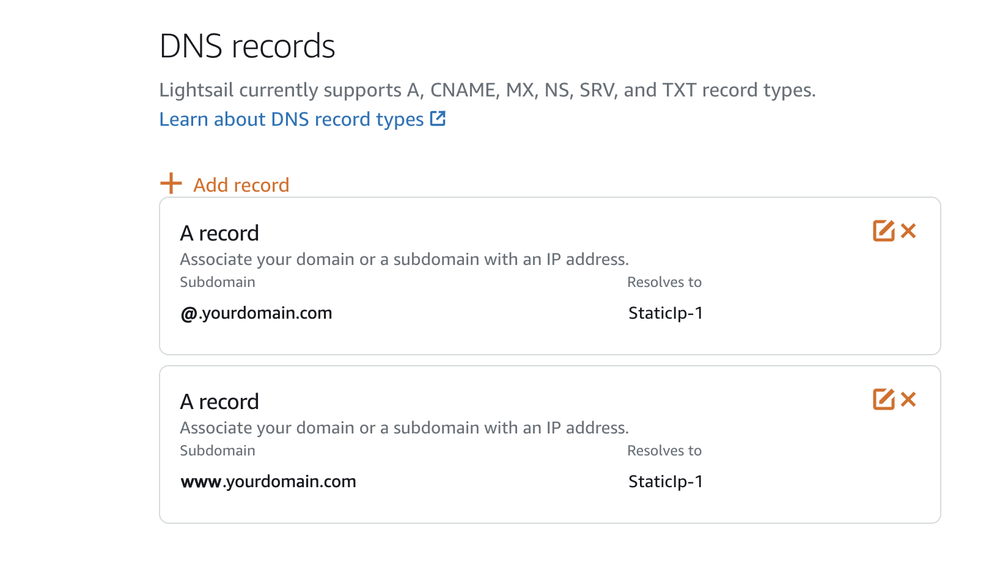

# Deploy a Node / Express app on AWS Lightsail with a Custom Domain + SSL

[Video Tutorial (_10 min_)](https://www.youtube.com/watch?v=rtshCulV2hk)

---

### Steps below if you prefer images

Create a Lightsail instance from the **[AWS dashboard](https://lightsail.aws.amazon.com/ls/webapp/home/instances)**

Choose your instance type

`Linux & Node`

Wait for the instance to be created

In the meantime, go to the `Networking` tab and click on `Create static IP`

Attach the static IP you just created to your instance

Go back [home](https://lightsail.aws.amazon.com/ls/webapp/home/instances) and click on [networking](https://lightsail.aws.amazon.com/ls/webapp/home/networking) so that you arrive at this tab

Click on **_Create DNS zone_** and enter your domain here

> I personally use [Google Domains](https://domains.google.com/registrar/) to buy my domains but if you prefer to stay in the ecosystem, Amazon has their own solution called [Route53](https://aws.amazon.com/route53/)

> I will be using `opensourceme.app` for the rest of this tutorial as I have this one for testing

Click `create` and add two `A` records

The first one should be `@` in the first box on the left and `Resolves to` should be the static IP address we created a few steps ago

Your second one should be `www` in the first box and once more, select your static IP

Add the name servers that Amazon provides you to your domain in your registrar's settings. The following is for Google Domains:

